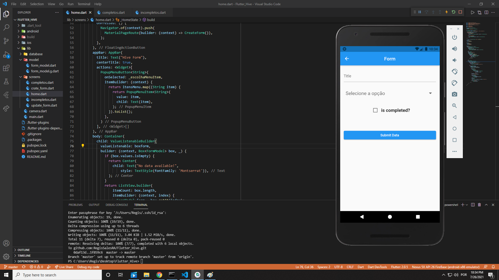

# Flutter Hive Study

Follow Steps:

# Flutter

First Step:

    flutter packages get
        
Second Step:

    flutter run

Create new boxed:

flutter packages pub run build_runner build;

#  Fast View from Project
 

# Home

# Layout Form

 

https://github.com/themaaz32/hive_todo_teach/blob/master/lib/main.dart
https://stackoverflow.com/questions/69470156/flutter-hive-how-to-filter-hive-box-to-listenable